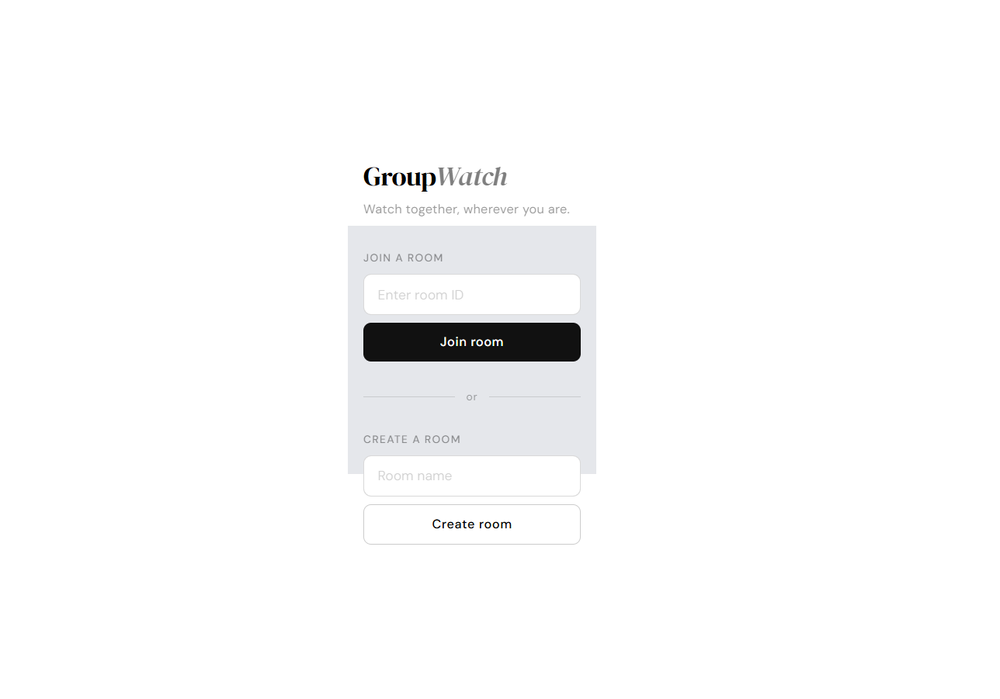
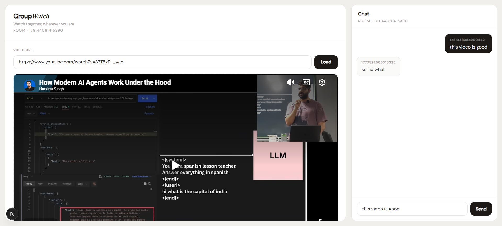

# GroupWatch

A real-time synchronized video streaming platform that allows groups of people to watch YouTube videos together from anywhere in the world.

##  Overview

GroupWatch enables seamless group viewing experiences by synchronizing playback across all participants in real-time. Create a room, invite friends via room ID, and enjoy synchronized YouTube videos with live chat—all without leaving the platform.





##  Key Features

- ** Synchronized Playback** - All group members watch at the exact same timestamp with host-controlled play, pause, and seek controls
- ** Real-time Group Chat** - Communicate instantly with all participants in the room
- ** YouTube Integration** - Stream any YouTube video seamlessly using the official YouTube Iframe API
- ** Room Management** - Create custom rooms or join existing ones using room IDs
- ** Host Controls** - Room hosts can control playback for synchronized viewing

##  Technology Stack

### Frontend
- **Next.js 16.2.4** - React framework with App Router
- **React 19.2.4** - UI library
- **TypeScript** - Type safety
- **Tailwind CSS 4** - Styling
- **Socket.io Client** - Real-time communication
- **YouTube Iframe API** - Video playback

### Backend
- **Express 5.2.1** - Web framework
- **Socket.io 4.8.3** - WebSocket communication
- **TypeScript** - Type safety
- **CORS** - Cross-origin request handling

### Development Tools
- **pnpm** - Monorepo package manager
- **ESLint** - Code linting
- **tsx** - TypeScript execution for Node.js

##  Getting Started

### Prerequisites
- Node.js 18+
- pnpm 10.33.0+

### Installation

1. **Install dependencies** (from the root directory):
```bash
pnpm install
```

2. **Start the backend server** (from `group-watch-socket` directory):
```bash
cd group-watch-socket
pnpm run dev
```
The Socket.io server will run on `http://localhost:4000`

3. **Start the frontend** (from `group-watch` directory, in a new terminal):
```bash
cd group-watch
pnpm run dev
```
The Next.js app will run on `http://localhost:3000`

##  Usage

1. **Create a Room**: Enter a room name and click "Create room" on the home page
2. **Share Room ID**: Copy the generated room ID to share with friends
3. **Join a Room**: Enter a room ID and click "Join room"
4. **Share Video**: Paste a YouTube URL to share with the group
5. **Watch Together**: All participants see synchronized playback controlled by the host
6. **Chat**: Send messages in real-time with other room participants

##  Socket.io Events

### Client → Server
- `joinRoom` - User joins a room
- `leaveRoom` - User leaves a room
- `sendMessage` - Send a chat message
- `sendVideo` - Share a YouTube video
- `videoAction` - Control video playback (play/pause/seek) - Host only

### Server → Client
- `userJoined` - Notification when a user joins
- `userLeft` - Notification when a user leaves
- `hostLeft` - Notification when host disconnects
- `receivedMessage` - Chat message received
- `receivedVideo` - Video share received
- `videoAction` - Playback action received

##  Room Logic

- **Room Creation**: Any user can create a room; the creator becomes the host
- **Host Privileges**: Only the host can control video playback (play, pause, seek)
- **Room Deletion**: When the host leaves, the room is automatically deleted
- **User Management**: Multiple users can join a room using its ID; users are tracked by unique userId (stored in localStorage)

##  Known Limitations & TODOs

- Room state is stored in-memory; data is lost on server restart
- User authentication is basic (localStorage-based)
- Error handling and validation could be enhanced
- some edge cases for video synchronization may need improvement

## 📦 Available Scripts

### Frontend (group-watch)
- `pnpm run dev` - Start development server
- `pnpm run build` - Build for production
- `pnpm run lint` - Run ESLint

### Backend (group-watch-socket)
- `pnpm run dev` - Start development server with auto-reload

## 📄 License

MIT LICENSE. See [LICENSE](../LICENSE) for details.
